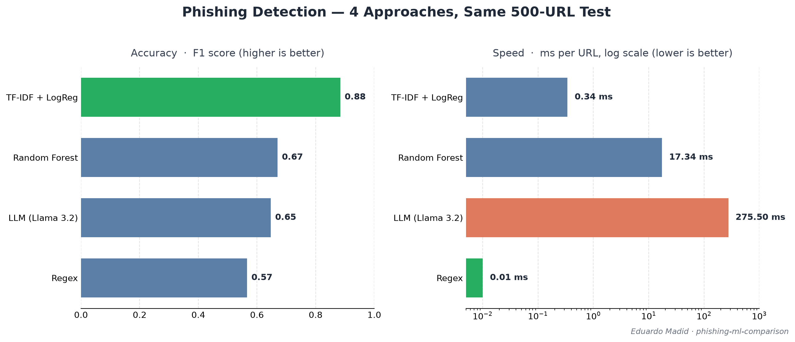

# Phishing ML Comparison

**🌐 Language / Idioma:** **English** · [🇧🇷 Português](README.pt-br.md)

> Detecting phishing from URLs alone — comparing **4 approaches** (regex → classical ML → embeddings → local LLM) on the **same data**, measuring F1, latency, and cost. The goal is not the model — it's the honest measurement of *when each approach is worth it*.




---

## 🎯 Summary — the table that says it all

All four approaches evaluated on the **same 500-URL test sample** (`random_state=42`), so the comparison is strictly apples-to-apples. The sample size is capped by the slowest approach (the LLM).

| Approach | F1 (phishing) | Precision | Recall | ms / URL | Cost |
|----------|:-------------:|:---------:|:------:|:--------:|:----:|
| **TF-IDF + LogReg** 🥇 | **0.884** | 0.839 | 0.934 | 0.34 | $0 |
| Random Forest (8 features) | 0.670 | 0.621 | 0.726 | 17.34 | $0 |
| LLM — Llama 3.2 3B (zero-shot) | 0.647 | 0.595 | 0.708 | 275.50 | GPU |
| Regex baseline | 0.566 | **0.783** | 0.443 | **0.01** | $0 |

**Reading it:** the cheapest *learned* model (TF-IDF + Logistic Regression) wins on F1 *and* is ~800× faster than the LLM. The LLM — the most hyped technology — placed **3rd**, below a Random Forest using 8 hand-counted features. Regex has the **highest precision** of all (when it cries "phishing", it's usually right) but the worst recall.

> **The point of this project is not the model. It's the honest measurement of trade-offs** — when each approach is worth it, with real numbers.

---

## ❓ The Problem

Phishing URLs impersonate legitimate sites to steal credentials. Detecting them **from the URL string alone** (no page content, no network calls) is a cheap first line of defense used in browsers, email filters, and SOCs. The question this project answers: **which technique actually pays off for this task — and why?**

---

## 🗂️ The Dataset

[Phishing Site URLs — Kaggle](https://www.kaggle.com/datasets/taruntiwarihp/phishing-site-urls): ~549k labeled URLs (`good` / `bad`), raw — **no pre-extracted features** (feature engineering is part of the exercise).

What the EDA revealed (and why it mattered):

| Finding | Number | Consequence |
|---------|--------|-------------|
| Duplicates removed | 42,150 (→ 507,196 rows) | dupes leak between train/test and inflate metrics |
| Class balance | 77.5% good / 22.5% bad | **accuracy is misleading** — a "always good" model scores 0.775 |
| URL length (phishing) | mean **71** / median 47 | phishing URLs run longer → a usable feature |
| URL length (legit) | mean **46** / median 40 | — |

The imbalance is why every model uses `class_weight="balanced"` and a **stratified** train/test split, and why the headline metric throughout is **F1 of the phishing class**, never accuracy.

---

## 🔬 The 4 Approaches (the journey)

### 1. Regex baseline — "the floor"

Hand-written heuristic rules with a scoring threshold. Improved **empirically**, not by guesswork:

| Iteration | F1 (phishing) | What changed |
|-----------|:-------------:|--------------|
| 6 rules, threshold ≥ 2 | 0.29 | naive start |
| threshold ≥ 1 | 0.43 | recall doubled |
| + 3 domain rules | 0.47 | suspicious TLDs, digits-in-domain, brand impersonation |
| **ablation cleanup** | 0.50 | removed `hyphens` rule — it **hurt** (-0.03): legit blogs use many hyphens in slugs |
| expanded keywords | **0.54** | added legacy phishing tokens (`webscr`, `cgi-bin`, `cmd=_`) → precision jumped to 0.79 |

A **leave-one-out ablation study** ranked each rule's contribution. Key insight: the rule that *looked* sensible (`too many hyphens`) was actively harming the model — proven by data, not intuition.

### 2. Classical ML — hand-crafted features

8 structural features (length, dot count, digit count, etc.) fed to scikit-learn:

- **Logistic Regression, no scaling → F1 0.44** (worse than regex!). Cause: features on wildly different scales (length ~2000 vs `has_ip` ∈ {0,1}) — the large ones dominate.
- **+ StandardScaler →** same F1 but **5× faster training** (scaling helps convergence, not this recall problem).
- **+ `class_weight="balanced"` → F1 0.49.**
- **Random Forest → F1 0.66.** Non-linear: it learns thresholds and feature interactions automatically — essentially the regex, but discovered by the data.

`feature_importances_` confirmed it: `length` + `digits` drove 52% of decisions; `has_ip` and `@` were near-useless — **the same conclusion the regex ablation reached independently.** Two different methods agreeing = a conclusion you can trust.

### 3. TF-IDF — let the machine read the text

Character n-grams (3–5) + Logistic Regression. No manual features:

- **F1 0.89** (full 101k test set) — a big jump. The model learned, on its own, that sequences like `webscr`, `.exe`, `login`, `php`, `.edu` are signal — **rediscovering the regex keywords without being told.**
- **Honesty check:** I suspected "shortcut learning" — that year tokens (`2011`, `/09`) were temporal artifacts. I **tested it** instead of assuming: years 2009/2010/2011 are all ~98.6% `good`, *consistently*. That refuted the bias hypothesis (content sites date their URLs — a legit signal), and confirmed the strong tokens (`login` appears in 99.5% phishing) are genuine.

### 4. Embeddings & LLM — testing the hype

- **Sentence embeddings** (`all-MiniLM-L6-v2`, 384-dim): **F1 0.79** on a 30k sample. On the *same* 30k, TF-IDF scored **0.86** — and was **~80× faster**. Embeddings capture *meaning*; a URL isn't natural language, so the semantic model loses.
- **Local LLM** (Llama 3.2 3B, in Docker, GPU-accelerated):
  - It first **refused** the task (a safety guardrail confused "classify phishing" with "conduct phishing"). Fixed with prompt engineering (explicit defensive role).
  - Zero-shot: **F1 0.65**, **275 ms/URL**.
  - **Few-shot made it worse** — twice. Both cartoonish and realistic examples pushed the small model into flagging almost everything (F1 ~0.40). Few-shot helps *large* models; it can hurt small ones.

---

## 📊 Results in two contexts

The Summary table is the **fair** comparison (everyone on the same 500 URLs, LLM-limited). But the cheap approaches can run the **full 101k test set** — more statistically robust for them. Both views, on purpose:

**A) Unified benchmark — 500 URLs, identical sample (fair, LLM included)**
→ see [Summary table](#-summary--the-table-that-says-it-all).

**B) Full-scale single tests — cheap approaches on the full 101k test set (robust, LLM excluded — too slow)**

| Approach | F1 (phishing) | Precision | Recall | Test size |
|----------|:-------------:|:---------:|:------:|:---------:|
| TF-IDF + LogReg | 0.89 | 0.85 | 0.93 | 101,440 |
| Random Forest (8 feat) | 0.66 | 0.61 | 0.72 | 101,440 |
| Regex baseline | 0.54 | 0.79 | 0.41 | 101,440 |
| Embeddings + LogReg | 0.79 | 0.71 | 0.89 | 10k (encoding cost) |
| LLM (zero-shot) | 0.65 | 0.60 | 0.71 | 500 (speed cost) |

The numbers track closely between the two contexts — TF-IDF wins in both. Context B shows the cheap models' real ceiling at scale; context A is the only one that can fairly include the LLM.

### Honest caveats (the part that makes it credible)
- The LLM result is for a **small (3B), zero-shot, URL-only** model. A frontier model or curated few-shot would do better — this compares *approaches under equal constraints*, not the last word on each technology.
- The dataset is **static**; real phishing is adversarial and shifts over time. ~0.89 is realistic for an academic dataset, optimistic vs. production.

---

## 🏗️ Architecture & Deploy

```
                    URL (text)
                        │
   ┌──────────┬─────────┼──────────┬──────────┐
   ▼          ▼         ▼          ▼          ▼
 Regex   RandomForest TF-IDF   Embeddings   LLM
   │          │         │          │          │
   └──────────┴─────────┴──────────┴──────────┘
                        │  benchmark.py (same sample, same metric)
                        ▼
              Winner: TF-IDF + LogReg
                        │
                        ▼
        joblib  →  FastAPI  →  Docker (multi-stage)
```

- **Serialization:** the winning `{vectorizer, model}` is saved with `joblib`.
- **API:** FastAPI with automatic validation (Pydantic), a `/predict` endpoint returning label + confidence, a health check, and auto-generated docs at `/docs`.
- **Docker:** **multi-stage build → 586 MB image** (~75% smaller than a naive single-stage build bundling PyTorch). Runs as a **non-root user**, with a `HEALTHCHECK`.
- **Compose:** one command to run the service.
- **Engineering decision:** the **LLM was deliberately left out of the deployment.** The API serves the *winner* (TF-IDF), not the most impressive-looking option. Coherence over hype.

---

## 📁 Project structure

```
phishing-ml-comparison/
├── data/                         # dataset (gitignored — download from Kaggle)
│   └── .gitkeep
├── models/
│   └── phishing_model.joblib     # serialized winner (versioned so Docker just works)
├── src/
│   ├── features.py               # structural feature extraction
│   ├── prepare_data.py           # stratified train/test split
│   ├── train_model.py            # train + serialize the winning model
│   ├── benchmark.py              # unified comparison (same sample, same metric)
│   ├── api.py                    # FastAPI service
│   └── classifiers/
│       ├── regex_baseline.py     # 1. heuristic rules + ablation study
│       ├── ml_classic.py         # 2. structural features + LogReg / RandomForest
│       ├── ml_tfidf.py           # 3. char n-grams + LogReg (winner)
│       ├── ml_embeddings.py      # 4a. sentence embeddings + LogReg
│       └── ml_llm.py             # 4b. local LLM (Ollama) zero/few-shot
├── Dockerfile                    # multi-stage build (586 MB)
├── docker-compose.yml
├── requirements.txt              # dev (full, incl. torch)
├── requirements-api.txt          # prod (lean, API only)
├── README.md                     # English
└── README.pt-br.md               # Português
```

## 🚀 How to run

```bash
git clone https://github.com/EduardoMadid/phishing-ml-comparison.git && cd phishing-ml-comparison

# Option A — the API (winner), containerized
docker compose up -d --build
curl -X POST http://localhost:8000/predict \
  -H "Content-Type: application/json" \
  -d '{"url": "secure-paypal.tk/webscr?cmd=login"}'
# → {"url":"...","label":"bad","confidence":1.0}

# Interactive docs:  http://localhost:8000/docs
```

```bash
# Option B — reproduce the experiments
python -m venv .venv && source .venv/Scripts/activate   # (Windows Git Bash)
pip install -r requirements.txt
python -m src.prepare_data          # stratified train/test split
python -m src.classifiers.regex_baseline
python -m src.classifiers.ml_tfidf
python -m src.benchmark             # the unified comparison table
```

---

## 🧠 What I learned

- **Accuracy lies on imbalanced data.** F1 of the minority class is the honest metric (precision / recall / confusion matrix over a single number).
- **Look at the data *before* engineering a feature.** An "is it HTTPS?" rule flagged *everything* as phishing — the dataset's URLs have no protocol prefix. Only caught by actually running it.
- **Prevent data leakage:** fit the scaler/vectorizer on **train only**, never on the full set — otherwise test information bleeds into training and the metrics lie.
- **Feature engineering > model choice.** The same data went from F1 0.49 (linear, structural features) to 0.89 (TF-IDF) — the jump came from *not hiding the strongest signal* (the text) from the model.
- **When two independent methods agree, trust the result.** The regex ablation and the Random Forest's feature importances reached the *same* ranking (`@` and IP are useless).
- **The right tool depends on the problem, not the hype.** A 1972 technique beat a 2026 LLM here — and was ~800× faster.
- **Test your own hypotheses.** My "temporal leakage" worry and my "few-shot will help" bet were both refuted by data. Method over intuition.
- **AI guardrails can block legitimate defensive work.** The LLM refused to classify phishing until the prompt made the defensive intent explicit — prompt engineering as a security skill.
- **Security note:** `joblib`/`pickle` execute code on load — never `load()` an untrusted model file (real RCE vector). `safetensors` exists to solve this for neural nets.

---

## 🔮 Future work

- **Temporal split** (train on older URLs, test on newer) to measure real generalization vs. an adversary.
- **Larger LLM / curated few-shot** for a fairer LLM ceiling.
- **More signals:** domain age (WHOIS), TLS cert, reputation feeds — what production systems actually use.

---

## ⚙️ Stack

`Python 3.13` · `pandas` · `scikit-learn` · `sentence-transformers` · `Ollama (Llama 3.2)` · `FastAPI` · `Docker`
